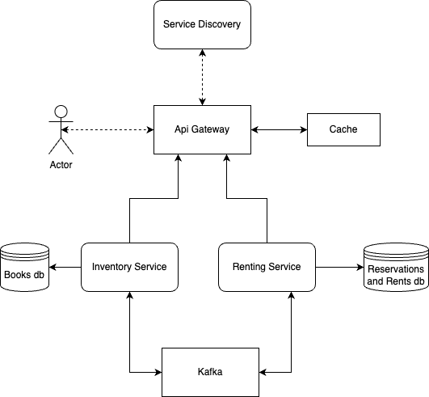

# Library Inventory Management System:
## _Author: Lozovanu Silviu_ 
### _Group: FAF-202_  

> **Idea Summary:**  
> Simple but at the same time a powerful and efficient tool that will make the life of librarians and not only a lot easier.  
> Librarians will have the possibility to manage the inventory of a library, thus adding new books removing the one that were destroyed or lost, possibility to track the loans.  
> Reader can also benefit from such an system, having possibility to make an reservation of a book or canceling it, and having possibility to search a specific book.
## Application Suitability:
>Scalability: A library inventory management system may need to handle varying loads throughout the year, such as during exam periods or the start of a new semester. Microservices can be independently scaled to meet these fluctuations in demand, ensuring efficient resource utilization.  
> Frequent Updates: Libraries may need to adapt to changing requirements, regulations, or user preferences. Microservices enable rapid development and deployment of updates to specific services without interrupting the overall system's operation.  
> Parallel Development: Microservices allow development teams to work on different parts of the system concurrently. This speeds up development cycles and enables teams to focus on their areas of expertise.  
> Resource Optimization: Not all components of a library inventory management system may experience the same levels of activity. With microservices, you can allocate resources based on actual usage, optimizing costs and resource utilization.  
> Scalable Data Management: Distributed databases can be used in conjunction with microservices to manage large volumes of library data efficiently. Each service can have its data store optimized for its specific needs.  
> Talking about real-world applications which use microservices architecture i can give as an example Airbnb, the similarity between my project and Airbnb would be that both of them have an service which will take care of reservations and cancellations, also for sure there is a service which takes care of all search requests the user inputs.
## Arhitecture 

## Service Boundaries

***Inventory Service:*** Used for modifying or searching data about books, it will perform such operations as search, add, remove, update books. 

***Renting Service:*** Encapsulates functionality of making a reservation, cancelling a reservation, creating a rent instance and closing a rent instance.

##  Technology Stack and Communication Patterns 

- **Gateway:** JS, NestJs framework
- **Inventory Service:** .NET, MongoDB. 
- **Renting Service Service:** .NET , MongoDB.
- **Kafka** Communication between services

## Design Data Management

1. **Inventory Service**
  > `Get health `
  * Response Body/Message: `{"ready":bool, "database": string{"connected" / "disconnected"}, "load" bool}`

> `Get search/{criteria}`
  * Response Body/Message: `[{"bookId":guid, "bookName": string,"bookAuthor": string "availableCount": int,"reservedCount": int}]`

  > `Get allBooks`
  * Response Body/Message: `[{"bookId":guid, "bookName": string,"bookAuthor": string "availableCount": int,"reservedCount": int}]`

 > `Post addBook`
  * Request Message: `{ "bookName": string,"bookAuthor": string "availableCount": int}`
  * Response Body/Message: `{"Successfully added"}`

 > `Post removeBook`
  * Request Message: `{ "bookId":guid }`
  * Response Body/Message: `{"Successfully removed"}`

 > `Post updateInfo/flag={operationType}/id`
  * Request Message: `{ "bookId":guid}`
  * Response Body/Message: `{"Successfully updated"}`

    
2. **Renting Service** 
  > `Get health `
   * Response Body/Message: `{"ready":bool, "database": string{"connected" / "disconnected"}, "load" bool}`

  > `Post reserve`  
   * Request Message: `{ "bookId": guid, "customerName": string}`
   * Response Message: `{ "reservedUntil": DateTime}` 

  > `Post lease` 
   * Request Message: `{ "bookId": guid, "customerName": string}`
   * Response Message: `{ "returnDate": DateTime }` 

  > `Post cancel-reservation` 
   * Request Message: `{ "reservationId": guid}`
   * Response Message: `{ "Successfully canceled reservation"}` 

  > `Post close-lease` 
   * Request Message: `{ "leaseId": guid,}`
   * Response Message: `{ "Successfully ended lease"}` 

  > `Get search-leases/{customerName}` 
   * Response Message: `[{"leaseId": guid, "bookId": guid, "lean-start-date": DateTime, "returnDate": DateTime, "customerName": string}]`

  > `Get all-leases` 
   * Response Message: `[{"leaseId": guid,"bookId":guid, "lean-start-date": DateTime, "returnDate": DateTime, "customerName": string}]`
  > `Get all-reservations`
   * Response Message: `[{"reservationId": guid, "bookId":guid, "reservedUntil": DateTime, "customerName": string}]`
  

## Deployment and Scaling 
* For this purpose I will use Docker Containerization.
